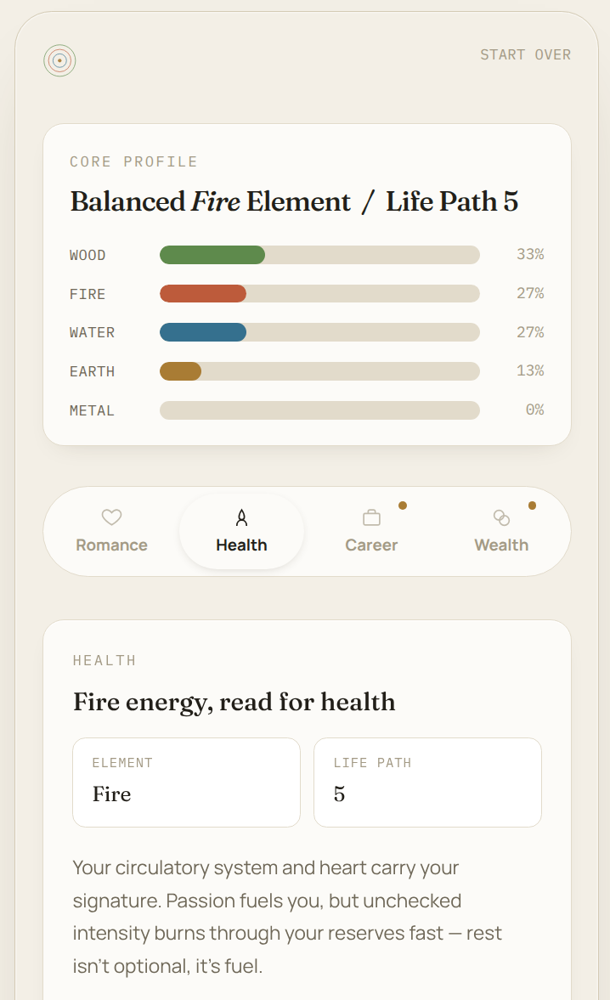

# Wu Xing — Elemental Self Reading

A single-page app for Bazi / elemental personality analysis. Enter a birthdate (and optionally birth time + city) to get a Bazi elemental profile, life path number, and locked/unlocked insights across romance, health, career, and wealth.

Built with React 19, TypeScript 6, Vite 8, and Tailwind CSS 4. Profile calculations are served by a Go server (`server/`).

## Commands

| Action | Command |
|--------|---------|
| Dev (frontend) | `npm run dev` |
| Dev (server) | `go run ./server` |
| Build | `npm run build` |
| Lint | `npm run lint` |
| Preview | `npm run preview` |
